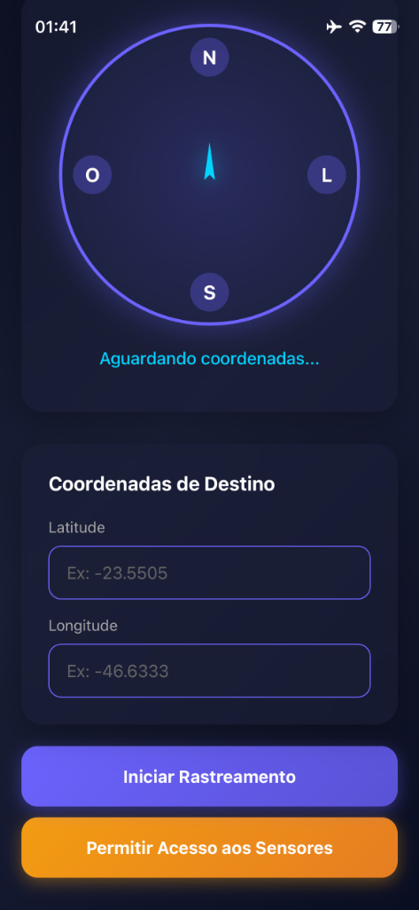

# 🧭 AlinhadorPtP Telecom

Aplicação multiplataforma para alinhamento de equipamentos Point-to-Point (PtP) de telecomunicações usando bússola georreferenciada.

## 📋 Sobre o Projeto

O **AlinhadorPtP Telecom** é uma ferramenta essencial para técnicos de telecomunicações que precisam alinhar antenas e equipamentos PtP com precisão. O aplicativo usa o sensor de bússola do dispositivo (magnetômetro) ou GPS para indicar a direção exata de um ponto de destino, facilitando a instalação e manutenção de links de rádio.

### ✨ Funcionalidades

- 🧭 **Bússola Georreferenciada**: Aponta precisamente para o destino baseado em coordenadas GPS
- 📍 **Rastreamento em Tempo Real**: Atualização contínua da posição e direção
- 📏 **Cálculo de Distância**: Mostra distância em tempo real até o ponto de destino
- 🔄 **Fallback Inteligente**: Usa GPS quando magnetômetro não está disponível
- ⚡ **PWA Pronta**: Versão web instalável funciona offline
- 📱 **Multiplataforma**: Android, iOS, Web, Windows, Linux e macOS
- 🎨 **Interface Moderna**: Design glassmorphism com gradientes vibrantes

### 🎯 Casos de Uso

- Alinhamento de antenas PtP para enlaces de micro-ondas
- Instalação de equipamentos de rádio enlaces
- Manutenção preventiva e corretiva de torres
- Levantamento de sites para novos enlaces

## 🚀 Tecnologias Utilizadas

### Frontend Flutter
- **Flutter**: Framework multiplataforma
- **Dart**: Linguagem de programação

### Dependências Principais
- **geolocator** (11.0.0): Obtenção de coordenadas GPS
- **flutter_compass** (0.8.0): Acesso ao sensor de bússola/magnetômetro
- **permission_handler** (11.0.0): Gerenciamento de permissões do sistema

### Web (PWA)
- **HTML5**: Estrutura semântica
- **CSS3**: Glassmorphism, animações e gradientes
- **JavaScript**: Lógica da aplicação web
- **Service Worker**: Funcionamento offline
- **Geolocation API**: Posicionamento GPS no navegador
- **DeviceOrientation API**: Acesso ao sensor de orientação

## 📦 Instalação

### Pré-requisitos

- Flutter SDK 3.10.8 ou superior
- Dart SDK
- Android Studio / Xcode (para builds mobile)
- Navegador moderno (para PWA)

### Configuração do Projeto

1. **Clone o repositório**
```bash
git clone https://github.com/seu-usuario/alinhador_telecom.git
cd alinhador_telecom
```

2. **Instale as dependências**
```bash
flutter pub get
```

3. **Verifique a configuração**
```bash
flutter doctor
```

## 🎮 Como Usar

### Aplicativo Mobile (Android/iOS)

1. **Execute em modo debug**
```bash
# Android
flutter run

# iOS (requer macOS)
flutter run -d ios
```

2. **Gere o APK (Android)**
```bash
flutter build apk --release
```

3. **Gere o Bundle (iOS)**
```bash
flutter build ios --release
```

### Versão Web (PWA)

1. **Execute o servidor de desenvolvimento**
```bash
flutter run -d chrome
```

2. **Gere build de produção**
```bash
flutter build web --release
```

3. **Sirva a versão web** (você pode usar o `server.py` incluído)
```bash
python server.py
```

Acesse em: `http://localhost:8000`

### Como Alinhar um Equipamento

1. **Permitir permissões**: Conceda acesso à localização e sensores
2. **Inserir coordenadas**: Digite latitude e longitude do ponto de destino
3. **Iniciar rastreamento**: Toque em "Iniciar Rastreamento"
4. **Seguir a seta**: A seta azul aponta para o destino
   - Para dispositivos com magnetômetro: resposta em tempo real
   - Para dispositivos sem magnetômetro: caminhe alguns metros para obter direção via GPS
5. **Calibração (se necessário)**: Mova o celular fazendo "8" no ar caso a bússola precise calibração

## 📱 Plataformas Suportadas

| Plataforma | Status | Observações |
|-----------|--------|-------------|
| 🤖 Android | ✅ Testado | Requer sensor de magnetômetro ou GPS |
| 🍎 iOS | ✅ Testado | Requer permissão DeviceOrientation |
| 🌐 Web (PWA) | ✅ Testado | Funciona em Chrome, Safari, Edge |
| 🪟 Windows | ⚠️ Parcial | Apenas com GPS (sem magnetômetro) |
| 🐧 Linux | ⚠️ Parcial | Apenas com GPS (sem magnetômetro) |
| 🍎 macOS | ⚠️ Parcial | Apenas com GPS (sem magnetômetro) |

## 🏗️ Estrutura do Projeto

```
alinhador_telecom/
├── android/              # Configurações Android
├── ios/                  # Configurações iOS
├── lib/
│   └── main.dart        # Código principal Flutter
├── web/
│   ├── index.html       # HTML da PWA
│   ├── style.css        # Estilos da PWA
│   ├── app.js           # Lógica JavaScript
│   ├── manifest.json    # Manifesto PWA
│   └── sw.js            # Service Worker
├── windows/             # Configurações Windows
├── linux/               # Configurações Linux
├── macos/               # Configurações macOS
├── pubspec.yaml         # Dependências Flutter
├── server.py            # Servidor HTTP simples (opcional)
└── README.md            # Este arquivo
```

## ⚙️ Configurações

### Permissões Android
Já configuradas no `AndroidManifest.xml`:
- `ACCESS_FINE_LOCATION`
- `ACCESS_COARSE_LOCATION`
- `INTERNET`

### Permissões iOS
Já configuradas no `Info.plist`:
- `NSLocationWhenInUseUsageDescription`
- `NSLocationAlwaysUsageDescription`

### PWA
O aplicativo web:
- Funciona **offline** após primeira visita
- Pode ser **instalado** no dispositivo
- Suporta tela cheia (fullscreen)

## 🐛 Troubleshooting

### Bússola sempre em 0°
- **Causa**: Magnetômetro precisa calibração
- **Solução**: Mova o celular fazendo movimentos em "8" no ar

### "Sensor de bússola não disponível"
- **Causa**: Dispositivo não tem magnetômetro
- **Solução**: O app usará GPS heading (caminhe alguns metros)

### Permissões negadas
- **Solução**: Vá em Configurações > Apps > AlinhadorPtP > Permissões e habilite Localização

### iOS não mostra orientação
- **Solução**: É necessário tocar em "Permitir Acesso aos Sensores" devido a políticas do iOS 13+

## 📸 Screenshots

<p align="center">
  
</p>

A imagem acima mostra o aplicativo em ação:
- **Esquerda**: Rastreamento ativo mostrando distância de 7.09 km e direção de 223°
- **Centro**: Tela inicial aguardando entrada de coordenadas com botões de ação
- **Direita**: Permissões concedidas e coordenadas preenchidas, pronto para iniciar

## 🤝 Contribuindo

Contribuições são bem-vindas! Sinta-se à vontade para:

1. Fazer fork do projeto
2. Criar uma branch para sua feature (`git checkout -b feature/NovaFuncionalidade`)
3. Commit suas mudanças (`git commit -m 'Adiciona nova funcionalidade'`)
4. Push para a branch (`git push origin feature/NovaFuncionalidade`)
5. Abrir um Pull Request

## 📄 Licença

Este projeto está sob a licença MIT. Veja o arquivo `LICENSE` para mais detalhes.

## 👤 Autor

Desenvolvido com ❤️ e ☕ para facilitar o trabalho de técnicos de telecomunicações.

## 🔗 Links Úteis

- [Documentação Flutter](https://flutter.dev/docs)
- [Geolocator Package](https://pub.dev/packages/geolocator)
- [Flutter Compass Package](https://pub.dev/packages/flutter_compass)
- [PWA Documentation](https://web.dev/progressive-web-apps/)

---

**🧭 AlinhadorPtP Telecom** - Precisão em cada alinhamento.
